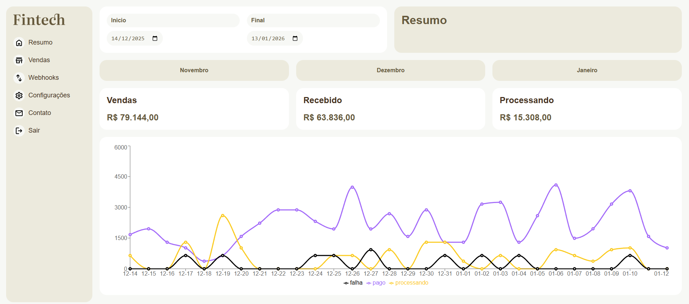

# Fintech

  

Uma aplicação web construída em React com TypeScript, criada durante o curso React com TypeScript da Origamid. O sistema exibe um dashboard de vendas consumindo dados fictícios expostos pela API usada nas aulas, demonstrando uso de hooks, tipagem e consumo de API em React.

## Demo

   `
   https://fintech-sigma-two.vercel.app/
   `

## ⚙️ Funcionalidades
- Componentização
- Uso de hooks personalizados
- Consumo de API
- Tipagem forte com TypeScript

## 🛠️ Tecnologias
O projeto foi construído com:
- React
- TypeScript
- Vite
- Fetch para consumo de API

## 📋 Pré-requisitos
Você precisa ter instalado: 
- Node.js (versão 22+)
- npm

## Executando localmente
1. Clone o repositório

   `
   git clone https://github.com/danieldpalma/fintech.git
   `

2. Entre na pasta do projeto

   `
   cd fintech
   `

3. Instale as dependências

   `
   npm install
   `

4. Inicie o servidor de desenvolvimento

   `
   npm run dev
   `

5. Acesse

   `
   http://localhost:5173
   `